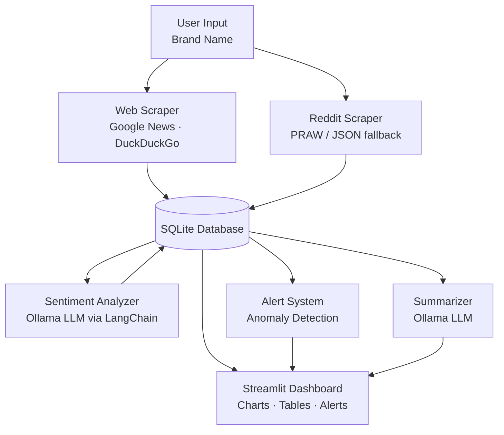

# Brand Monitoring Dashboard


A full-stack brand monitoring tool that scrapes mentions across the web, runs sentiment analysis using a **local LLM** (no external API keys required), detects anomalies, and generates AI-powered brand perception summaries — all from a Streamlit dashboard.

---

## Screenshots

<!-- After running the app, drop images in /screenshots and uncomment below -->
<!--
| Overview | Mentions |
|----------|----------|
|  |  |

| Alerts | Summary |
|--------|---------|
|  |  |
-->

---

## Technical Highlights

- **Local LLM integration** — Sentiment analysis and summary generation run entirely on-device via Ollama + LangChain. No data leaves your machine, no API keys required.
- **Multi-source data pipeline** — Aggregates brand mentions from Google News RSS, DuckDuckGo News, and Reddit (authenticated PRAW or unauthenticated JSON fallback) into a unified schema.
- **Statistical anomaly detection** — Alert engine compares rolling sentiment ratios and daily mention volumes against historical baselines to surface negative spikes before they escalate.
- **SQLite persistence layer** — Normalized schema with indexes on brand, source, sentiment, and published date; URL uniqueness constraint prevents duplicate ingestion.
- **100+ unit tests, zero external dependencies** — Full test suite with `pytest` and `unittest.mock`; no Ollama server or Reddit credentials required to run tests.
- **Interactive Streamlit dashboard** — Multi-tab UI with Plotly charts for sentiment distribution, source breakdown, and time-series trends.

---

## Architecture



---

## Features

- **Multi-source scraping** — Google News RSS, DuckDuckGo News, and Reddit
- **Sentiment analysis** — Ollama (Llama 3.1) analyzes each mention locally
- **Trend visualization** — Sentiment distribution and time-series charts via Plotly
- **Alert system** — Detects negative sentiment spikes and unusual volume changes
- **AI summaries** — Generates comprehensive brand perception summaries
- **Historical data** — SQLite stores all mentions for trend analysis

---

## Prerequisites

1. **Install Ollama** — Download from [ollama.ai](https://ollama.ai)

2. **Pull the required model**:
   ```bash
   ollama pull llama3.1
   ```

3. **Start Ollama** (if not running as a service):
   ```bash
   ollama serve
   ```

---

## Installation

1. Clone the repository:
   ```bash
   git clone https://github.com/YOUR_USERNAME/YOUR_REPO.git
   cd YOUR_REPO
   ```

2. Create a virtual environment:
   ```bash
   python -m venv venv
   source venv/bin/activate  # Linux/Mac
   venv\Scripts\activate     # Windows
   ```

3. Install dependencies:
   ```bash
   pip install -r requirements.txt
   ```

4. Configure environment variables:
   ```bash
   cp .env.example .env
   # Edit .env with your Reddit credentials (optional)
   ```

---

## Usage

### Option A — Demo mode (no Ollama required)

Seed the database with realistic pre-analyzed data and explore the full dashboard immediately:

```bash
python seed_demo_data.py        # seeds Tesla, Apple, and Nike
python seed_demo_data.py --clear  # wipe and re-seed from scratch
```

Then launch the dashboard and enter **Tesla**, **Apple**, or **Nike** in the sidebar — all charts, the mentions table, and alerts will be populated.

### Option B — Live mode

1. Start the application:
   ```bash
   streamlit run app.py
   ```
   On Windows you may need:
   ```bash
   py -m streamlit run app.py
   ```

2. Open your browser to `http://localhost:8501`

3. **Enter a brand name** in the sidebar (e.g. *Apple*, *Tesla*, *Nike*)

4. **Click "Scrape & Analyze"** to gather mentions and run sentiment analysis:
   - Collects news from Google News RSS and DuckDuckGo News
   - Collects Reddit posts via the public JSON API
   - Analyzes the sentiment of each mention using the local LLM

5. **Explore the dashboard tabs**:
   - **Overview** — Sentiment metrics, pie chart, source distribution, and trends
   - **Mentions** — Browse and filter individual mentions with source links
   - **Alerts** — Detect negative spikes or unusual volume changes
   - **Summary** — Generate an AI-powered brand perception summary

---

## Project Structure

```
brand-monitoring/
├── .github/
│   └── workflows/
│       └── ci.yml                # GitHub Actions CI
├── app.py                        # Streamlit dashboard
├── src/
│   ├── alerts.py                 # Anomaly detection engine
│   ├── database.py               # SQLite operations
│   ├── reddit_scraper.py         # Reddit scraping (PRAW + fallback)
│   ├── sentiment_analyzer.py     # Ollama sentiment analysis
│   ├── summarizer.py             # AI summary generation
│   └── web_scraper.py            # Google/DuckDuckGo News scraping
├── tests/
│   ├── conftest.py               # Shared pytest fixtures
│   ├── test_alerts.py
│   ├── test_database.py
│   ├── test_reddit_scraper.py
│   ├── test_sentiment_analyzer.py
│   └── test_web_scraper.py
├── data/
│   └── brand_monitoring.db       # SQLite database (auto-created, gitignored)
├── seed_demo_data.py             # Populate DB with realistic demo data (no Ollama needed)
├── .env.example                  # Environment variable template
├── .python-version               # Python version pin (3.11)
└── requirements.txt
```

---

## Alert Types

| Alert | Trigger | Severity |
|-------|---------|----------|
| Negative Spike | 30%+ increase in negative sentiment ratio | Low / Medium / High |
| Volume Spike | 2× normal daily mention volume | Medium |
| Highly Negative | Individual mention with score ≤ −0.8 | Medium |

---

## Configuration

### Sentiment Analyzer (`src/sentiment_analyzer.py`)
- `model` — Ollama model name (default: `llama3.1`)
- `temperature` — Adjust for consistency vs. creativity (default: `0`)

### Alert Thresholds (`src/alerts.py`)
- `negative_spike_threshold` — Ratio increase to trigger alert (default: `0.3`)
- `min_mentions_for_alert` — Minimum data points required (default: `5`)

### Scraping (`src/web_scraper.py`)
- `request_delay` — Delay between requests to avoid rate limiting (default: `1.0s`)

---

## Data Storage

All data is stored in `data/brand_monitoring.db` (SQLite, gitignored):

| Table | Contents |
|-------|----------|
| `mentions` | Scraped content with sentiment scores |
| `summaries` | Generated brand perception summaries |
| `alerts` | Alert history with acknowledgement status |

---

## Testing

All external dependencies are mocked — no Ollama server or Reddit credentials required.

```bash
# Run all tests
pytest

# Verbose output
pytest -v

# With coverage report
pytest --cov=src --cov-report=term-missing

# Specific module
pytest tests/test_alerts.py
```

---

## Troubleshooting

**"Connection refused" error**
```bash
ollama serve
```

**No Reddit results**
Reddit's public API may rate-limit requests. Wait a few minutes between scrapes, or add Reddit API credentials to `.env` for authenticated access.

**Slow sentiment analysis**
Each mention requires one LLM call. For faster processing, use a smaller model:
```bash
ollama pull llama3.2:1b
# Then set OLLAMA_LLM_MODEL=llama3.2:1b in .env
```

**Empty charts**
Either click "Scrape & Analyze" after entering a brand, or run `python seed_demo_data.py` to pre-populate the database with demo data instantly.

---

## License

MIT — see [LICENSE](LICENSE).
